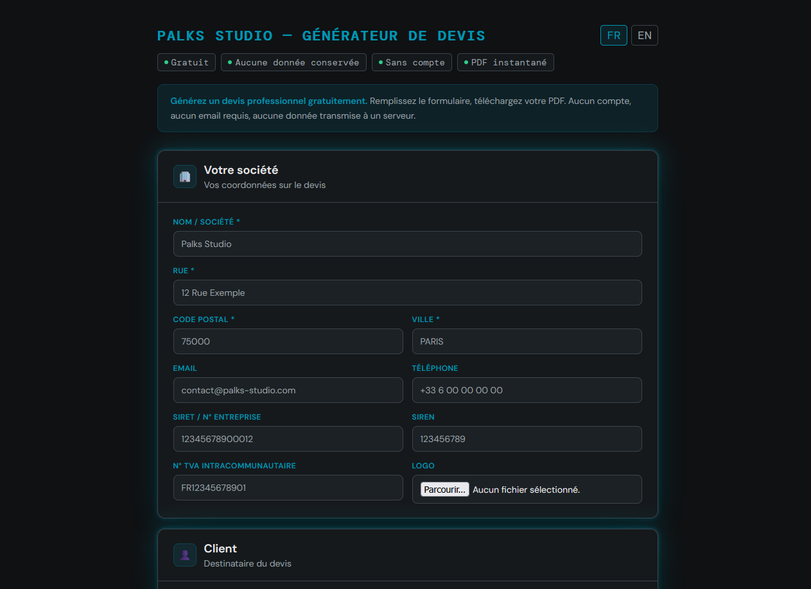

<p align="center">
  
</p>

> 🇫🇷 Français | [🇬🇧 English](./README.md)


<p align="center">
  <a href="https://palks-studio.com">
    
  </a>
</p>

# Générateur de devis gratuit — Palks Studio

> Ce dépôt constitue une présentation technique et une documentation du projet.  
> Il ne contient pas de code source téléchargeable ni de fichiers de production.

Un outil web 100% client-side pour générer des devis professionnels en PDF, sans compte, sans serveur, sans données transmises.

**[→ Accéder à l'outil](https://palks-studio.com/fr/generateur-devis)**

---

## Fonctionnalités

- Génération de devis PDF directement dans le navigateur  
- Bilingual **FR / EN** — interface et PDF  
- Logo personnalisé (PNG, JPEG, SVG, WebP)  
- Informations émetteur complètes : SIRET, SIREN, TVA intracommunautaire  
- Lignes de prestations dynamiques avec calcul automatique HT / TVA / TTC  
- Multi-devises : EUR, USD, GBP, CHF, CAD  
- Bloc **Bon pour accord** avec date et signature  
- Design print-friendly — fond blanc, encre minimale  
- Reset automatique du formulaire après téléchargement  
- Aucune donnée conservée, aucun cookie, aucun tracking

---

## Utilisation

Aucune installation requise. Ouvrir `index.html` dans un navigateur.

```bash
git clone https://github.com/palks-studio/devis-generator.git
cd devis-generator
open index.html
```


Ou simplement déposer le fichier sur n'importe quel hébergement statique (Netlify, GitHub Pages, etc.).

---

## Stack

| Technologie                                     | Usage                      |
|-------------------------------------------------|----------------------------|
| HTML / CSS / JS vanilla                         | Interface                  |
| [jsPDF](https://github.com/parallax/jsPDF)      | Génération PDF côté client |
| [DM Sans + DM Mono](https://fonts.google.com/)  | Typographie                |

Aucun framework, aucune dépendance NPM, aucun build step.

---

## Structure

```
index.html       # Tout-en-un : formulaire + styles + logique + génération PDF
```


---

## Confidentialité

Le PDF est généré **entièrement dans le navigateur**. Aucune donnée n'est envoyée à un serveur. Aucun stockage local (`localStorage` désactivé). Le formulaire est réinitialisé après chaque téléchargement.

---

© Palks Studio — voir LICENSE.md  
- https://palks-studio.com