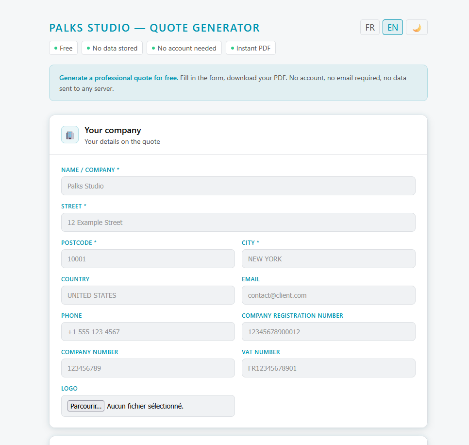

<p align="center">
  
</p>

> 🇬🇧 English | [🇫🇷 Français](./README_FR.md)


[](https://palks-studio.com/fr/generateur-devis)

<p align="center">
  <a href="https://palks-studio.com">
    
  </a>
</p>

# Free Quote Generator — Palks Studio

> This repository is a technical presentation and documentation repository.  
> It does not contain downloadable source code or production files.

A 100% client-side web tool to generate professional PDF quotes — no account, no server, no data transmitted.

**[→ Open the tool](https://palks-studio.com/fr/generateur-devis)**

---

## Use cases

Typical usage scenarios:  

- freelancers generating quick quotes  
- consultants sending simple proposals  
- small businesses preparing client quotes  
- educational examples of client-side PDF generation

---

## Features

- PDF quote generation directly in the browser  
- Bilingual **FR / EN** — interface and PDF  
- Custom logo upload (PNG, JPEG, SVG, WebP)  
- Full issuer details: company number, VAT number  
- Dynamic line items with automatic subtotal / VAT / total calculation  
- Multi-currency: EUR, USD, GBP, CHF, CAD  
- **Approval block** with date and signature fields  
- Print-friendly design — white background, minimal ink  
- Automatic form reset after download  
- No data stored, no cookies, no tracking

---

## Stack

| Technology                                     | Usage                      |
|------------------------------------------------|----------------------------|
| HTML / CSS / JS vanilla                        | Interface                  |
| [jsPDF](https://github.com/parallax/jsPDF)     | Client-side PDF generation |
| [DM Sans + DM Mono](https://fonts.google.com/) | Typography                 |

No framework, no NPM dependencies, no build step.

---

## How it works

The generator runs entirely in the browser.

Workflow:  

1. User fills the quote form  
2. Data is processed in JavaScript  
3. The PDF is generated using **jsPDF**  
4. The file is downloaded locally

No request is sent to a server and no data is stored.

---

## Structure

```
index.html       # All-in-one: form + styles + logic + PDF generation
```


---

## Limitations

This tool is designed for simple quote generation.

It does not include:  

- server-side storage  
- invoice numbering systems  
- accounting integrations  
- payment processing

For advanced workflows, a dedicated billing system is required.

---

## Privacy

The PDF is generated **entirely in the browser**. No data is sent to any server. No local storage (`localStorage` disabled). The form resets automatically after each download.

---

© Palks Studio — see LICENSE.md  
- https://palks-studio.com
