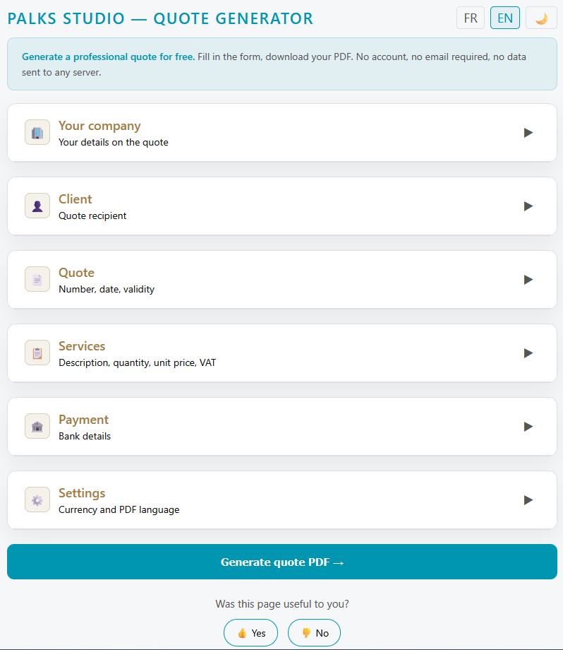

<p align="center">
  
</p>

> 🇬🇧 English | [🇫🇷 Français](./README_FR.md)


[](https://www.youtube.com/@Palks_Studio)
[](https://www.linkedin.com/in/palks-studio/)
[](https://palks-studio.com/en/quote-generator)

<p align="center">
  <a href="https://palks-studio.com">
    
  </a>
</p>

# Free Quote Generator for France & USA — Palks Studio

> This repository provides a technical presentation and demonstration of the system.  
> It does not contain downloadable source code or production files.

A 100% client-side web tool for generating professional PDF quotes for issuers established in France and the United States, with no account, no server and no data transmitted.

[Access the Resource](https://palks-studio.com/en/quote-generator)

---

## Use cases

Typical usage scenarios:  

- freelancers quickly generating a client quote  
- consultants preparing a professional proposal  
- small businesses creating quotes for their clients  
- businesses and independent professionals established in France or the United States  
- international quotes in EUR, USD and other supported currencies  
- educational demonstration of client-side PDF generation

---

## Features

- PDF quote generation directly in the browser  
- Bilingual **FR / EN** interface and PDF  
- Issuers in **France and the United States**  
- Country-specific issuer information: SIRET, SIREN, EU VAT number or EIN  
- Custom logo support (PNG, JPEG, SVG, WebP)  
- Dynamic service lines with automatic subtotal, tax and total calculations  
- Multi-currency support: EUR, USD, GBP, CHF, CAD  
- French VAT and US Sales Tax handling depending on the context  
- **Good for agreement / Bon pour accord** section with date and signature  
- Print-friendly design with a white background and minimal ink usage  
- Automatic form reset after download  
- No data transmitted, no cookies, no tracking

---

## Tax handling — France & United States

The generator adapts tax rules and legal notices according to the issuer's country, the client's country and type, and the nature of the transaction.

### France

The generator handles situations including:

- French VAT  
- intra-EU transactions  
- reverse charge when the corresponding conditions are met  
- transactions with clients outside the EU  
- VAT exemption under the CIBS reference used by the generator

### United States

For issuers established in the United States, the generator handles situations including:

- issuer identification using an EIN  
- billing in USD  
- Sales Tax for domestic transactions when the issuer indicates that it is registered  
- no US Sales Tax for foreign clients  
- B2B services supplied to EU businesses with a VAT number

US Sales Tax rates are not determined automatically. When tax applies, the rate is entered manually by the user.

---

## Stack

| Technology                                     | Usage                      |
|------------------------------------------------|----------------------------|
| HTML / CSS / JS vanilla                        | Interface                  |
| [jsPDF](https://github.com/parallax/jsPDF)     | Client-side PDF generation |
| [DM Sans + DM Mono](https://fonts.google.com/) | Typography                 |

No framework, no NPM dependencies, no build step.

---

## How it works

The generator runs entirely in the browser.

Workflow:  

1. User fills the quote form  
2. Data is processed in JavaScript  
3. The PDF is generated using **jsPDF**  
4. The file is downloaded locally

No request is sent to a server and no data is stored.

---

## Structure

```
index.html       # All-in-one: form + styles + logic + PDF generation
```

---

## Limitations

This tool is designed for simple quote generation.

It does not include:  

- server-side storage  
- invoice numbering systems  
- accounting integrations  
- payment processing  
- automatic calculation of US Sales Tax rates by state, county or jurisdiction

For advanced workflows, a dedicated billing system is required.

---

## Privacy

The PDF is generated **entirely in the browser**. No data is sent to any server. No local storage (`localStorage` disabled). The form resets automatically after each download.

---

© Palks Studio — see LICENSE.md  
- https://palks-studio.com
