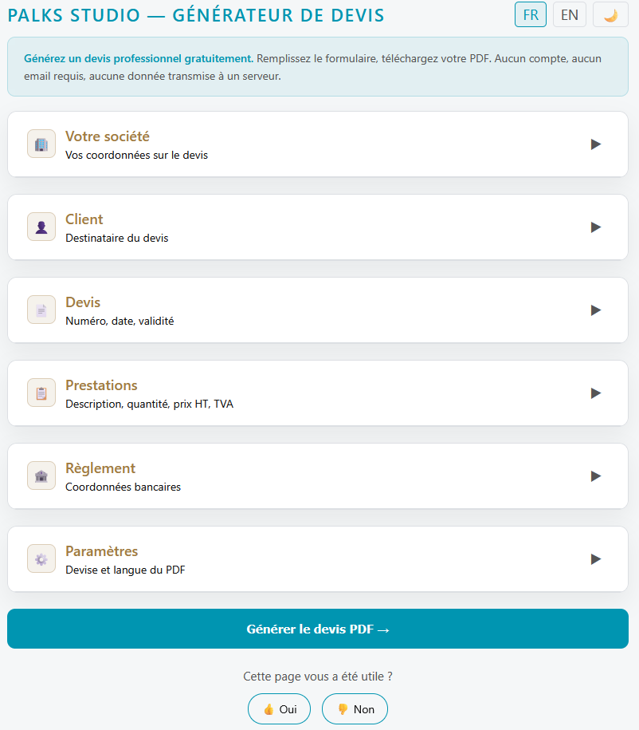

<p align="center">
  
</p>

> 🇫🇷 Français | [🇬🇧 English](./README.md)


[](https://www.youtube.com/@Palks_Studio)
[](https://www.linkedin.com/in/palks-studio/)
[](https://palks-studio.com/fr/generateur-devis)

<p align="center">
  <a href="https://palks-studio.com">
    
  </a>
</p>

# Générateur de devis gratuit France & USA — Palks Studio

> Ce dépôt constitue une présentation technique et une démonstration du système.  
> Il ne contient pas de code source téléchargeable ni de fichiers de production.

Un outil web 100% client-side pour générer des devis professionnels en PDF pour les émetteurs établis en France et aux États-Unis, sans compte, sans serveur, sans données transmises.

[Accéder à la ressource](https://palks-studio.com/fr/generateur-devis)

---

## Cas d’usage

Exemples d’utilisation :  

- freelances générant rapidement un devis  
- consultants envoyant une proposition simple  
- petites structures préparant un devis client  
- démonstration pédagogique de génération de PDF côté navigateur  
- entreprises et indépendants établis en France ou aux États-Unis  
- devis internationaux en EUR, USD et autres devises prises en charge

---

## Fonctionnalités

- Génération de devis PDF directement dans le navigateur  
- Bilingue **FR / EN** — interface et PDF  
- Émetteurs **France / États-Unis**  
- Informations émetteur adaptées au pays : SIRET, SIREN, TVA intracommunautaire ou EIN  
- Logo personnalisé (PNG, JPEG, SVG, WebP)  
- Lignes de prestations dynamiques avec calcul automatique HT / taxes / total  
- Multi-devises : EUR, USD, GBP, CHF, CAD  
- Gestion de la TVA française et de la Sales Tax américaine selon le contexte  
- Bloc **Bon pour accord** avec date et signature  
- Design print-friendly — fond blanc, encre minimale  
- Reset automatique du formulaire après téléchargement  
- Aucune donnée transmise, aucun cookie, aucun tracking

---

## Gestion fiscale France & États-Unis

Le générateur adapte les règles fiscales et les mentions affichées selon le pays de l'émetteur, le pays et le type de client, ainsi que la nature de l'opération.

### France

Le générateur prend notamment en charge :

- la TVA française  
- les opérations intracommunautaires  
- l'autoliquidation lorsque les conditions correspondantes sont réunies  
- les opérations avec des clients hors UE  
- la franchise en base avec la référence CIBS utilisée par le générateur

### États-Unis

Pour un émetteur établi aux États-Unis, le générateur prend notamment en charge :

- l'identification de l'émetteur par EIN  
- la facturation en USD  
- la Sales Tax pour les opérations domestiques lorsque l'émetteur indique être enregistré  
- l'absence de Sales Tax américaine pour les clients étrangers  
- les cas de prestations B2B vers l'Union européenne avec numéro de TVA

Le taux de Sales Tax américain n'est pas déterminé automatiquement. Lorsqu'une taxe est applicable, son taux est renseigné par l'utilisateur.

---

## Stack

| Technologie                                     | Usage                      |
|-------------------------------------------------|----------------------------|
| HTML / CSS / JS vanilla                         | Interface                  |
| [jsPDF](https://github.com/parallax/jsPDF)      | Génération PDF côté client |
| [DM Sans + DM Mono](https://fonts.google.com/)  | Typographie                |

Aucun framework, aucune dépendance NPM, aucun build step.

---

## Fonctionnement

Le générateur fonctionne entièrement dans le navigateur.

Flux de fonctionnement :  

1. l’utilisateur remplit le formulaire de devis  
2. les données sont traitées en JavaScript  
3. le PDF est généré avec **jsPDF**  
4. le fichier est téléchargé localement

Aucune requête n’est envoyée à un serveur et aucune donnée n’est stockée.

---

## Structure

```
index.html       # Tout-en-un : formulaire + styles + logique + génération PDF
```


---

## Limitations

Cet outil est conçu pour la génération simple de devis.

Il ne comprend pas :  

- de stockage côté serveur  
- de système de numérotation comptable  
- d’intégration avec un logiciel de facturation  
- de système de paiement  
- de calcul automatique des taux de Sales Tax américains selon l'État, le comté ou la juridiction

Pour des usages plus avancés, un moteur de facturation dédié est nécessaire.

---

## Confidentialité

Le PDF est généré **entièrement dans le navigateur**. Aucune donnée n'est envoyée à un serveur. Aucun stockage local (`localStorage` désactivé). Le formulaire est réinitialisé après chaque téléchargement.

---

© Palks Studio — voir LICENSE.md  
- https://palks-studio.com
